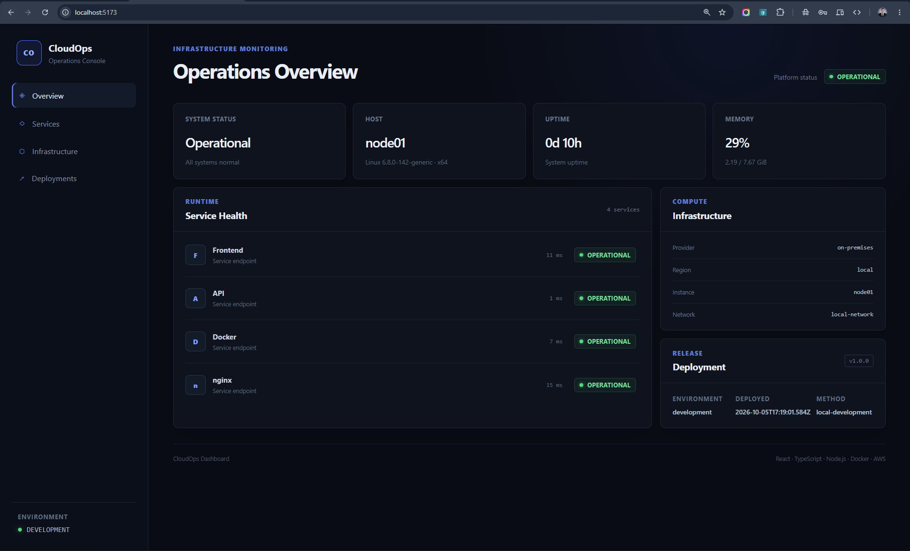
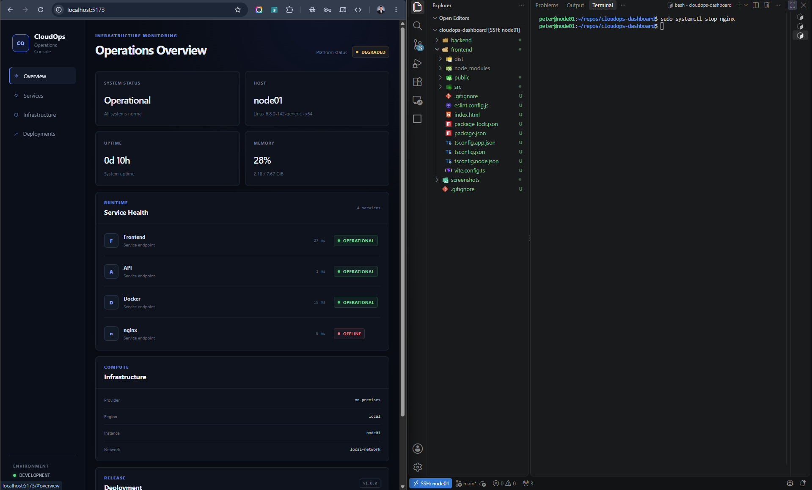
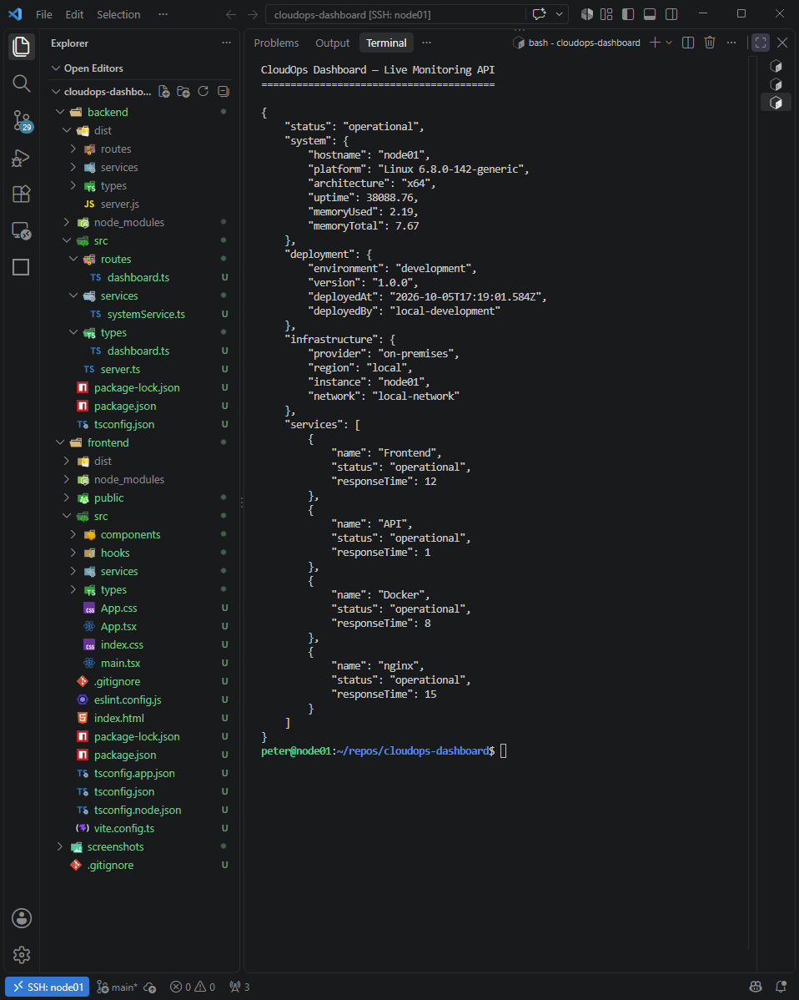
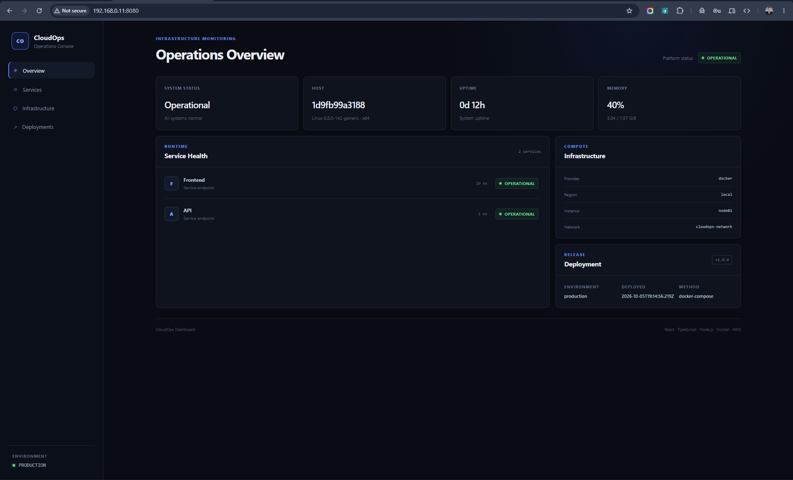
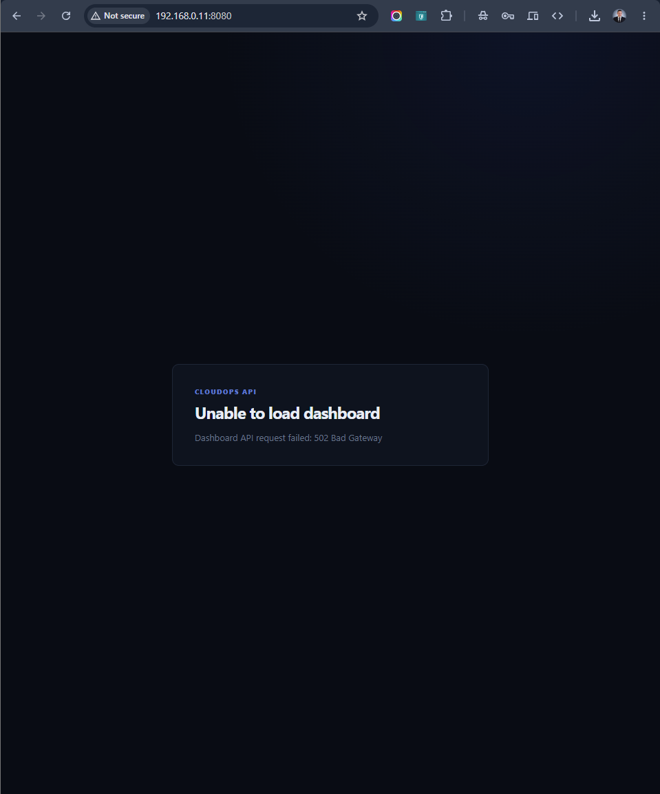

# CloudOps Dashboard

A full-stack operations dashboard built with **React, TypeScript, Node.js and Express**, containerised with **Docker** and served through an **nginx reverse proxy**.

The project combines software engineering with DevOps and infrastructure principles. A React frontend consumes live operational data from a typed REST API, while the backend collects system and service-health information and exposes deployment and infrastructure metadata.

The application supports both a local development architecture and a production-style multi-container deployment using Docker Compose.



## Overview

CloudOps Dashboard provides a single operational view of:

- overall platform health
- host and operating-system information
- system uptime
- memory utilisation
- individual service health
- deployment metadata
- infrastructure information
- service response times

The React application automatically requests fresh operational data every 10 seconds.

The project was designed not only to display infrastructure information, but also to demonstrate how application development, monitoring, containerisation, networking and deployment configuration can work together in a complete system.

## Technology Stack

### Frontend

- React 19
- TypeScript
- Vite
- CSS
- Fetch API
- ESLint

### Backend

- Node.js 24
- Express
- TypeScript
- REST API
- Node.js OS APIs
- Docker Engine API
- systemd service checks

### DevOps and Infrastructure

- Linux
- Docker
- Docker Compose
- Multi-stage Docker builds
- nginx
- Docker bridge networking
- Container health checks
- Git
- AWS deployment planned

## Architecture

The project supports two execution modes.

### Development Architecture

During development, Vite serves the React application and proxies API requests to the Express backend.

```text
Browser
   |
   v
React + TypeScript
Vite :5173
   |
   | /api/*
   v
Node.js + Express + TypeScript
:5000
   |
   +-- Linux system metrics
   +-- Docker Engine health
   +-- nginx service health
   +-- Frontend health
```

The Vite development proxy allows the frontend to use relative API paths such as:

```text
/api/dashboard
```

rather than hard-coding a backend hostname or port into the React application.

### Containerised Architecture

The production-style deployment uses separate frontend and backend containers connected through a private Docker bridge network.

```text
Browser
   |
   | :8080
   v
Frontend Container
nginx :80
   |
   +-- React production build
   |
   | /api/*
   v
cloudops-network
   |
   v
Backend Container
Express :5000
```

Only the nginx frontend is published to the host:

```text
Host :8080 -> frontend :80
```

The backend port is not published to the host. nginx reaches the Express service through Docker's internal network using the Compose service name:

```text
backend:5000
```

This keeps the API behind the application's reverse proxy rather than exposing it directly.

## TypeScript Data Contract

The frontend and backend use matching TypeScript data models for operational information.

```text
DashboardData
├── status
├── system
│   ├── hostname
│   ├── platform
│   ├── architecture
│   ├── uptime
│   ├── memoryUsed
│   └── memoryTotal
├── deployment
│   ├── environment
│   ├── version
│   ├── deployedAt
│   └── deployedBy
├── infrastructure
│   ├── provider
│   ├── region
│   ├── instance
│   └── network
└── services[]
    ├── name
    ├── status
    └── responseTime
```

Explicit interfaces provide compile-time type checking and make the expected API contract clear and maintainable.

## Live Monitoring

The backend collects operational information rather than returning a static dashboard.

The monitoring strategy changes depending on how the application is running.

### Host Development Mode

When running directly on the Linux host, monitoring includes:

| Component | Monitoring method |
| --- | --- |
| Frontend | HTTP health request |
| API | Active API state |
| Docker | Docker Engine Unix socket |
| nginx | systemd service state |
| System | Node.js OS APIs |

This mode allows the dashboard to monitor services running directly on the Linux server.

### Container Mode

When running through Docker Compose, the backend operates in container-aware monitoring mode.

The application monitors the frontend/nginx service over the private Docker network while avoiding a Docker socket mount inside the backend container.

This deliberately avoids granting the application container control over the host Docker daemon.

## Failure Detection

The host monitoring implementation was tested by deliberately stopping monitored services.

The dashboard detected the service failure, changed the affected service state to **offline**, and changed the overall platform state to **degraded**.



This demonstrates that the service-health indicators are driven by live backend monitoring rather than hard-coded frontend values.

## REST API

The Express backend exposes two primary endpoints:

```text
GET /api/health
GET /api/dashboard
```

`GET /api/health` provides a lightweight API health check.

`GET /api/dashboard` returns structured operational information including:

- hostname
- Linux kernel and platform
- architecture
- uptime
- memory usage
- deployment information
- infrastructure information
- individual service states
- service check response times

### Live API Monitoring Data



The React application consumes the API through a typed service layer.

A custom React hook retrieves the initial dashboard state and automatically polls the API every 10 seconds for updated operational information.

## Docker Containerisation

Both application layers use multi-stage Docker builds.

### Backend Image

The backend Docker build uses a Node.js build stage to:

1. install dependencies
2. compile the TypeScript source
3. produce the JavaScript application in `dist/`

A separate production stage installs only production dependencies and copies the compiled application from the builder.

The final backend container runs as the non-root `node` user.

```text
Node 24 builder
      |
      | npm ci
      | TypeScript compilation
      v
    dist/
      |
      v
Node 24 production image
      |
      | production dependencies only
      v
node dist/server.js
```

### Frontend Image

The frontend also uses a multi-stage build.

Node.js and Vite compile the React/TypeScript application during the build stage. The resulting static files are copied into a separate nginx image.

```text
Node 24 builder
      |
      | npm ci
      | npm run build
      v
    dist/
      |
      v
nginx production image
      |
      v
React static application
```

Node.js is therefore required to build the frontend but is not required to serve the compiled React application in production.

## nginx Reverse Proxy

nginx performs two roles in the containerised deployment:

- serves the compiled React application
- proxies `/api/*` requests to the backend container

The browser therefore communicates with one application entry point:

```text
http://host:8080
```

A frontend request such as:

```text
/api/dashboard
```

follows this path:

```text
Browser
   |
   v
nginx :80
   |
   | Docker internal DNS
   v
backend:5000
   |
   v
Express API
```

nginx also exposes a lightweight `/health` endpoint used by container health monitoring.

## Docker Compose

Docker Compose defines the complete containerised application.

The stack contains:

```text
cloudops-dashboard
|
├── frontend
│   ├── nginx
│   ├── React production build
│   ├── health check
│   └── host port 8080
│
├── backend
│   ├── Node.js
│   ├── Express
│   ├── health check
│   └── private port 5000
│
└── cloudops-network
    └── private bridge network
```

Compose provides:

- image builds
- container configuration
- environment variables
- private networking
- service dependencies
- health checks
- restart policies
- port publishing

The complete stack can be built and started with:

```bash
docker compose up -d --build
```

Its state can be inspected with:

```bash
docker compose ps
```

## Container Health Checks

Both application containers have health checks.

The backend health check queries:

```text
http://127.0.0.1:5000/api/health
```

The frontend health check queries nginx:

```text
http://127.0.0.1/health
```

Docker Compose can therefore distinguish between a container process merely running and the application inside that container actually responding.

## Environment-Driven Configuration

Deployment metadata is supplied through environment variables rather than being hard-coded into the application.

Configuration includes:

```text
APP_ENVIRONMENT
APP_VERSION
DEPLOYED_BY
CLOUD_PROVIDER
CLOUD_REGION
INSTANCE_NAME
NETWORK_NAME
MONITORING_MODE
FRONTEND_HEALTH_URL
```

The current containerised deployment reports:

| Property | Value |
| --- | --- |
| Environment | `production` |
| Version | `1.0.0` |
| Deployment method | `docker-compose` |
| Provider | `docker` |
| Region | `local` |
| Instance | `node01` |
| Network | `cloudops-network` |

This allows the same application image to be configured for different deployment environments without modifying application source code.

## Containerised Production Dashboard

The complete React, nginx and Express stack was deployed through Docker Compose and validated through the nginx entry point.



The dashboard confirms:

- production environment configuration
- Docker infrastructure metadata
- Docker Compose deployment metadata
- private application networking
- operational frontend service
- operational API service
- live system information

## Failure and Recovery Testing

Failure behaviour was tested in both the host and containerised architectures.

### Host Service Failure

During host-mode testing, nginx was deliberately stopped.

The backend detected the service failure during its next monitoring cycle, changed nginx to **offline**, and changed the overall platform status to **degraded**.

After nginx was restarted, the dashboard automatically detected its recovery.

### Container Backend Failure

The backend container was also deliberately stopped while the frontend container remained running.

nginx continued serving the compiled React application, but API requests could no longer reach Express.

The reverse proxy correctly returned:

```text
502 Bad Gateway
```

The React application detected the failed API request and displayed an explicit error state rather than presenting misleading operational data.



After the backend container was restored and returned to a healthy state, the React polling mechanism successfully retrieved dashboard data again and restored the operational view.

The complete recovery path is:

```text
Backend unavailable
        |
        v
nginx upstream request fails
        |
        v
HTTP 502 Bad Gateway
        |
        v
React API request detects failure
        |
        v
Error state displayed
        |
        v
Backend restored
        |
        v
API becomes healthy
        |
        v
React polling succeeds
        |
        v
Dashboard recovers
```

This demonstrates the difference between frontend availability, backend availability and complete application availability.

## Development

### Backend

Install dependencies and start the backend development server:

```bash
cd backend
npm install
npm run dev
```

The backend listens on:

```text
http://localhost:5000
```

### Frontend

In a second terminal:

```bash
cd frontend
npm install
npm run dev
```

The Vite development server runs on:

```text
http://localhost:5173
```

During development, Vite proxies `/api/*` requests to the Express backend.

## Containerised Deployment

Build and start the complete application:

```bash
docker compose up -d --build
```

Check container state:

```bash
docker compose ps
```

View application logs:

```bash
docker compose logs
```

Follow logs continuously:

```bash
docker compose logs -f
```

Stop the application:

```bash
docker compose down
```

The containerised application is exposed on:

```text
http://localhost:8080
```

The backend remains internal to the Docker network and does not require a published host port.

## Quality Checks

The frontend is validated with ESLint and a production TypeScript/Vite build:

```bash
cd frontend
npm run lint
npm run build
```

The backend is validated with TypeScript type checking and a production build:

```bash
cd backend
npm run typecheck
npm run build
```

The Compose configuration can be validated with:

```bash
docker compose config --quiet
```

Runtime health can be verified with:

```bash
docker compose ps
```

The project has been tested with:

- frontend lint validation
- frontend production build
- backend TypeScript type checking
- backend production build
- Docker image builds
- Docker Compose configuration validation
- frontend container health checks
- backend container health checks
- nginx reverse proxy requests
- API requests through nginx
- private backend networking
- deliberate service failure
- recovery testing

## Project Structure

```text
cloudops-dashboard/
├── backend/
│   ├── src/
│   │   ├── routes/
│   │   ├── services/
│   │   ├── types/
│   │   └── server.ts
│   ├── .dockerignore
│   ├── Dockerfile
│   ├── package.json
│   └── tsconfig.json
│
├── frontend/
│   ├── src/
│   │   ├── components/
│   │   ├── hooks/
│   │   ├── services/
│   │   ├── types/
│   │   ├── App.tsx
│   │   └── main.tsx
│   ├── .dockerignore
│   ├── Dockerfile
│   ├── nginx.conf
│   └── package.json
│
├── screenshots/
│   ├── 01-cloudops-dashboard.png
│   ├── 02-broken-services-with-terminal.png
│   ├── 03-live-api-monitoring-data.png
│   ├── 04-containerised-production-dashboard.png
│   └── 05-backend-failure-502-handling.png
│
├── docker-compose.yml
├── .gitignore
└── README.md
```

## Security and Deployment Decisions

Several implementation decisions were made deliberately to keep the deployment architecture closer to real production practices.

### Private Backend

The Express backend is not published directly to the host. API traffic enters through nginx and travels to the backend across the private Docker bridge network.

### Non-Root Backend

The production backend container runs as the standard non-root Node.js user rather than root.

### No Docker Socket in Container Mode

The host-mode backend can inspect the Docker Engine through its Unix socket.

The containerised backend does not mount `/var/run/docker.sock`.

A Docker socket mount would give the application significant control over the host Docker daemon, so container mode instead uses network-based service health checks.

### Environment-Based Deployment Metadata

Deployment-specific values are supplied through environment variables rather than being embedded in application source code.

These decisions reduce unnecessary host exposure and make the application easier to move between environments.

## Deployment Roadmap

The local application and containerisation stages are complete.

The next stage will extend the same application into AWS infrastructure, including:

```text
Internet
   |
   v
DNS
   |
   v
AWS networking
   |
   v
EC2
   |
   v
Docker Compose
   |
   +-- nginx / React
   |
   +-- Express API
```

Planned AWS work includes:

- VPC networking
- public subnet
- routing
- Internet Gateway
- Security Groups
- IAM
- EC2
- DNS
- cloud security configuration
- production deployment validation

The application and infrastructure documentation will continue to be updated as each cloud layer is implemented and tested.

## What This Project Demonstrates

CloudOps Dashboard combines software development, systems engineering and DevOps practices in one practical project.

It currently demonstrates:

- React component architecture
- TypeScript interfaces and type safety
- asynchronous REST API integration
- React hooks and state management
- automatic frontend polling
- Node.js and Express API development
- Linux system information collection
- live service-health monitoring
- Docker Engine integration
- systemd integration
- failure detection and recovery
- multi-stage Docker builds
- production React compilation
- nginx static content serving
- nginx reverse proxying
- Docker Compose orchestration
- private Docker networking
- Docker internal DNS
- container health checks
- non-root container execution
- environment-driven configuration
- service dependency management
- production build validation
- deliberate failure testing
- infrastructure-oriented application design

The next phase extends the same application into AWS networking, compute, IAM, security and DNS.

---

**CloudOps Dashboard** — React · TypeScript · Node.js · Express · Docker · Docker Compose · nginx · Linux · AWS